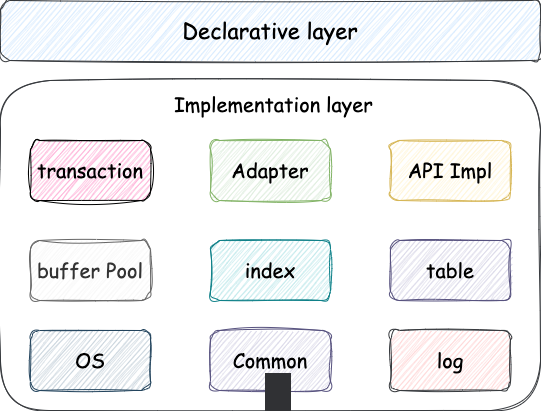

# EpiphanyDB


[](https://github.com/ULis3h/epiphanyDB/actions/workflows/codeql.yml)
    
`EpiphanyDB` 是一款为嵌入式系统设计的高性能\可靠的存储引擎,支持在有操作系统和无操作系统环境下运行.它提供了统一的存储接口,并可以适配多种流行的数据库系统.

## 特性

### 核心特性

### 存储特性

## 支持平台
- Windows
- Unix-like
- MacOS


## 功能

## 模块设计
除使用模板实现的模块外，所有的模块对外接口均在`include`目录中给出，在模块所属目录中实现，也就是`include`中仅进行声明，这样，如果希望更新某个模块，只需要实现`include`中的对应声明即可，无需修改其他模块. 模块的组织结构如下图所示:



* [X] [公共组件 common](docs/design/common/README.md)
* [ ] [缓冲池模块 Buffer Pool](docs/design/pager/README.md)
* [ ] [core](docs/design/core/README.md)
* [ ] [索引模块 index](docs/design/index/README.md)
* [ ] [mco_n](docs/design/mco_n/README.md)
* [ ] [os](docs/design/os/README.md)
* [ ] [txn](docs/design/txn/README.md)

## 编程接口

* [X] [epiphanydb capi](docs/user/user_capi.md)
* [ ] [epiphanydb cppapi](docs/user/user_cppapi.md)


## 构建

拉取源码：
```
$ git clone http://192.168.3.248:9091/root/enpiphany.git
```

### Unix-likes
```bash
$ mkdir build && cd build
```
```bash
$ cmake ..
```


### Windows - mingw
```
$ mkdir build && cd build
```

```cmd
$ cmake -G "MinGW Makefiles" ..
```

```
$ make
```

## 测试

### 基础测试

## TODO

- os  
  1. `TLFS` 算法.  
- common  
  1.内存池实现 [完成] 
  2.LRU缓存淘汰策略  [完成] [待测试]  
  3.LRU-K缓存淘汰策略
