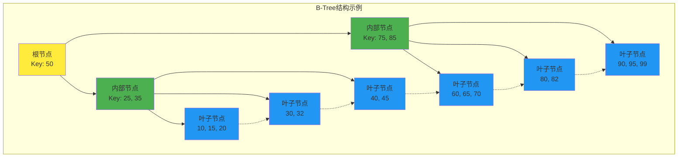
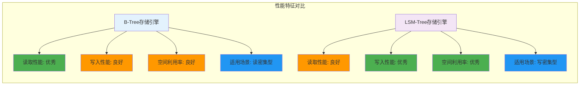

```mermaid
graph TB
    subgraph LSMARCH["LSM-Tree架构"]
        A[写入请求] --> B[MemTable<br/>内存表]
        B --> C{达到阈值?}
        C -->|是| D[Immutable MemTable<br/>不可变内存表]
        C -->|否| B
        D --> E[刷写到磁盘]
        E --> F[Level 0<br/>SSTable文件]
        
        F --> G{需要合并?}
        G -->|是| H[合并操作]
        G -->|否| F
        
        H --> I[Level 1<br/>SSTable文件]
        I --> J{需要合并?}
        J -->|是| K[合并操作]
        J -->|否| I
        
        K --> L[Level 2<br/>SSTable文件]
        L --> M[...]
    end
    
    subgraph READPATH["读取路径"]
        N[读取请求] --> O[检查MemTable]
        O --> P[检查Immutable MemTable]
        P --> Q[检查Level 0]
        Q --> R[检查Level 1]
        R --> S[检查Level 2]
        S --> T[返回结果]
    end
    
    style B fill:#4caf50
    style D fill:#ff9800
    style F fill:#2196f3
    style I fill:#2196f3
    style L fill:#2196f3
```

## 简述
这是数据库内核入门系列的第二篇文章，主要介绍数据库存储引擎的基本概念和实现原理。

{/* truncate */}

## 存储引擎概述
存储引擎是数据库管理系统中负责数据存储、查询和更新的核心组件。不同的存储引擎针对不同的应用场景进行了优化，提供了不同的特性和性能表现。

## 存储引擎的主要功能
- 数据文件的组织和管理
- 记录的格式化存储
- 索引的创建和维护
- 事务支持
- 并发控制
- 数据压缩
- 数据加密

## 常见的存储引擎类型

### B-Tree存储引擎
B-Tree（平衡树）是关系型数据库中最常用的索引结构，它能够保证数据有序，并且支持范围查询。

#### B-Tree的特点
- 所有叶子节点具有相同的深度
- 非叶子节点存储键值和指向子节点的指针
- 所有键值按顺序存储，便于范围查询
- 树的高度较低，查询效率高

#### B-Tree的变种
- B+Tree：所有数据都存储在叶子节点，非叶子节点只存储键值和指针
- B*Tree：非叶子节点至少2/3满，而不是1/2满，提高空间利用率

### LSM-Tree存储引擎
Log-Structured Merge Tree (LSM-Tree) 是为写入密集型应用设计的数据结构，被广泛应用于NoSQL数据库。

#### LSM-Tree的特点
- 写入性能优异
- 将随机写转换为顺序写
- 使用内存缓冲区和磁盘存储层
- 通过合并操作优化读取性能

#### LSM-Tree的工作原理
1. 新数据首先写入内存中的MemTable
2. 当MemTable达到一定大小时，将其转换为不可变的Immutable MemTable
3. Immutable MemTable被刷新到磁盘，形成SSTable (Sorted String Table)
4. 后台进程定期合并多个SSTable，减少读取时需要查询的文件数量

## 存储引擎性能对比

## 下一篇预告
在下一篇文章中，我们将深入探讨B-Tree存储引擎的实现细节，包括页面布局、节点分裂与合并等关键操作。

---
slug: database-kernel-02
title: 数据库内核入门-02 - 存储引擎(1)
authors: [ulis]
tags: [Database, Programming]
---

## 简述
这是数据库内核入门系列的第二篇文章，主要介绍数据库存储引擎的基本概念和实现原理。

## 存储引擎概述
存储引擎是数据库管理系统中负责数据存储、查询和更新的核心组件。不同的存储引擎针对不同的应用场景进行了优化，提供了不同的特性和性能表现。

## 存储引擎的主要功能
- 数据文件的组织和管理
- 记录的格式化存储
- 索引的创建和维护
- 事务支持
- 并发控制
- 数据压缩
- 数据加密

## 常见的存储引擎类型

### B-Tree存储引擎
B-Tree（平衡树）是关系型数据库中最常用的索引结构，它能够保证数据有序，并且支持范围查询。

#### B-Tree的特点
- 所有叶子节点具有相同的深度
- 非叶子节点存储键值和指向子节点的指针
- 所有键值按顺序存储，便于范围查询
- 树的高度较低，查询效率高

#### B-Tree的变种
- B+Tree：所有数据都存储在叶子节点，非叶子节点只存储键值和指针
- B*Tree：非叶子节点至少2/3满，而不是1/2满，提高空间利用率

### LSM-Tree存储引擎
Log-Structured Merge Tree (LSM-Tree) 是为写入密集型应用设计的数据结构，被广泛应用于NoSQL数据库。

#### LSM-Tree的特点
- 写入性能优异
- 将随机写转换为顺序写
- 使用内存缓冲区和磁盘存储层
- 通过合并操作优化读取性能

#### LSM-Tree的工作原理
1. 新数据首先写入内存中的MemTable
2. 当MemTable达到一定大小时，将其转换为不可变的Immutable MemTable
3. Immutable MemTable被刷新到磁盘，形成SSTable (Sorted String Table)
4. 后台进程定期合并多个SSTable，减少读取时需要查询的文件数量

## 下一篇预告
在下一篇文章中，我们将深入探讨B-Tree存储引擎的实现细节，包括页面布局、节点分裂与合并等关键操作。

