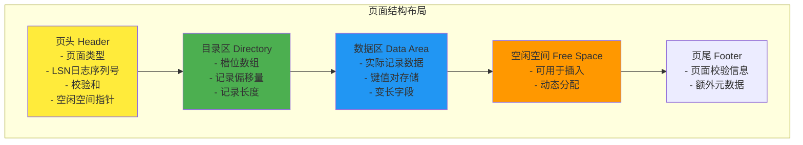
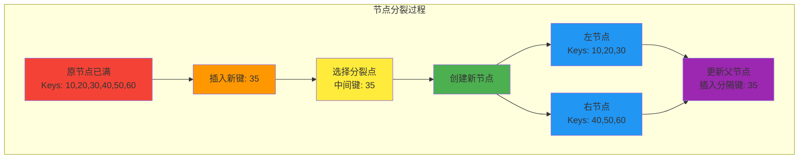
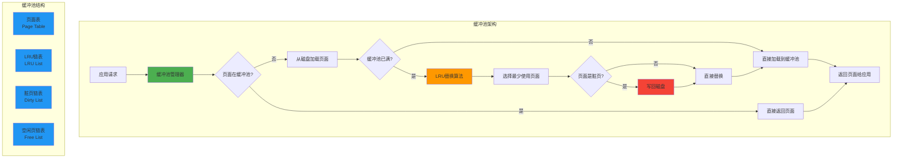
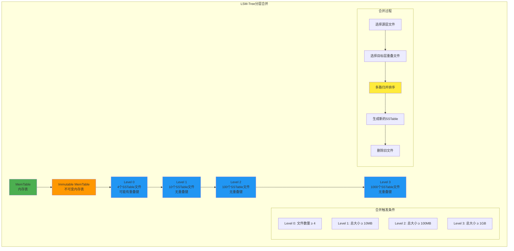

## 简述
这是数据库内核入门系列的第三篇文章，继续深入探讨存储引擎的实现细节，特别是B-Tree存储引擎的关键操作。

{/* truncate */}

## B-Tree存储引擎的实现

### 页面布局
B-Tree存储引擎通常基于页面进行管理，每个页面是磁盘I/O的基本单位。




#### 页面结构
- 页头：包含页面类型、LSN（日志序列号）、校验和等元数据
- 数据区：存储实际的键值对或记录
- 空闲空间：用于后续插入操作
- 页尾：可能包含一些额外的元数据

### 节点分裂
当B-Tree节点中的键值对数量超过其容量时，需要进行节点分裂操作。



#### 分裂步骤
1. 创建一个新节点
2. 将原节点中一半的键值对移动到新节点
3. 更新父节点，插入新的分隔键和指向新节点的指针
4. 如果父节点也满了，则递归进行分裂

### 节点合并
当B-Tree节点中的键值对数量过少时，可能需要进行节点合并操作以提高空间利用率。

#### 合并步骤
1. 选择一个兄弟节点（通常是相邻的）
2. 将当前节点的所有键值对移动到兄弟节点
3. 更新父节点，删除指向当前节点的指针和相应的分隔键
4. 释放当前节点

### 缓冲池管理
为了减少磁盘I/O，B-Tree存储引擎通常使用缓冲池来缓存频繁访问的页面。



#### 缓冲池组件
- 页面表：维护缓冲池中页面的映射关系
- 替换策略：如LRU（最近最少使用）、Clock等
- 脏页管理：跟踪被修改但尚未写回磁盘的页面

## LSM-Tree存储引擎的优化

### 布隆过滤器
布隆过滤器是LSM-Tree中的重要优化技术，用于快速判断某个键是否可能存在于SSTable中。

```mermaid
graph TB
    subgraph BLOOM["布隆过滤器工作原理"]
        A[输入键: key1] --> B[哈希函数1<br/>h1(key1)]
        A --> C[哈希函数2<br/>h2(key1)]
        A --> D[哈希函数3<br/>h3(key1)]
        
        B --> E[位数组位置1]
        C --> F[位数组位置2]
        D --> G[位数组位置3]
        
        E --> H[设置位为1]
        F --> I[设置位为1]
        G --> J[设置位为1]
        
        subgraph BITARRAY["位数组"]
            K[0|1|0|1|1|0|1|0|1|0]
        end
        
        H --> K
        I --> K
        J --> K
    end
    
    subgraph QUERY["查询过程"]
        L[查询键: key2] --> M[计算哈希值]
        M --> N{所有位都为1?}
        N -->|是| O[可能存在<br/>需要进一步查询]
        N -->|否| P[确定不存在<br/>直接返回]
    end
    
    style A fill:#4caf50
    style L fill:#2196f3
    style O fill:#ff9800
    style P fill:#f44336
    style K fill:#ffeb3b
```

#### 布隆过滤器特点
- 无假阴性：如果布隆过滤器说某个键不存在，那么它确实不存在
- 有假阳性：如果说存在，可能实际不存在，需要进一步查询
- 空间效率高：使用少量内存就能过滤大量不存在的查询

### 分层合并策略
LSM-Tree使用分层合并策略来管理不同层级的SSTable，平衡写入性能和读取效率。



#### 合并策略类型
- **Size-Tiered合并**：当某一层的文件数量达到阈值时触发合并
- **Leveled合并**：严格控制每层的大小，确保层间有序
- **混合策略**：结合两种策略的优点，在不同层使用不同策略

## 存储引擎的选择考量
选择合适的存储引擎需要考虑以下因素：

- 读写比例：读密集型应用可能更适合B-Tree，写密集型应用可能更适合LSM-Tree
- 数据规模：大规模数据可能需要考虑LSM-Tree的空间效率
- 查询模式：点查询、范围查询、全表扫描等不同查询模式对存储引擎有不同要求
- 一致性需求：不同存储引擎提供的事务隔离级别和持久性保证不同

## 下一篇预告
在下一篇文章中，我们将介绍数据库的事务管理，包括ACID特性、并发控制和恢复机制。